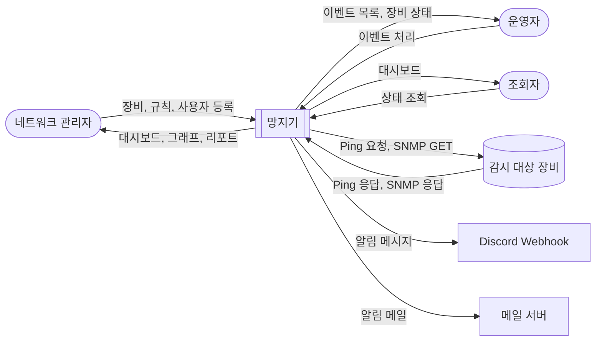
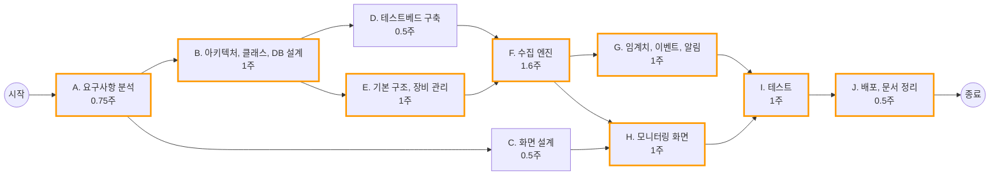
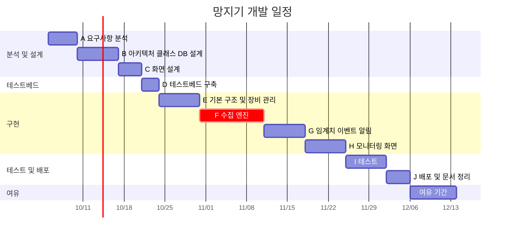

# 프로젝트 관리 계획서

- 프로젝트명: 소규모 네트워크 모니터링 시스템 '망지기(MangJigi)'
- 과목: 소프트웨어 공학
- 작성자: 22212060 김규진
- 기간: 2026.10.05 ~ 2026.12.13

## Revision history
| Revision date | Version | Description | Author |
|---|---|---|---|
| 26.10.04 | 0.1.0 | 첫 초안 작성 | kyujin |
| 26.10.09 | 0.2.0 | 제약사항, 규모 산정, WBS 내용 보완 | kyujin |

 

## 목차
1. [대상 제어기 선택](#1단계-대상-제어기-선택)
2. [프로젝트 범위 정의](#2단계-프로젝트-범위-정의)
3. [시스템 문맥도 및 이해관계자 분석](#3단계-시스템-문맥도-및-이해관계자-분석)
4. [제약사항](#4단계-제약사항)
5. [프로젝트 규모 산정](#5단계-프로젝트-규모-산정)
6. [주요 업무 구분 및 WBS](#6단계-주요-업무-구분-및-wbs)

---

## 1단계: 대상 제어기 선택

### 1.1 제어 대상과 제어기
이번 프로젝트에서 제어 대상은 서버, 라우터, 스위치 등으로 이루어진 소규모 네트워크이고, 제어기는 이 네트워크의 상태를 주기적으로 확인해서 이상이 있으면 관리자에게 알려주는 네트워크 모니터링 시스템(NMS) '망지기'이다.

| 구분 | 내용 |
|---|---|
| 제어 대상 | 소규모 네트워크의 장비 (서버, 라우터, 스위치) |
| 입력 (측정) | Ping 응답 여부와 응답 시간, SNMP로 얻는 CPU·메모리 사용률과 인터페이스 트래픽 |
| 판단 | 사용자가 정한 임계치와 비교, 연속 실패 횟수 확인 |
| 출력 (조치) | 대시보드에 상태 표시, Discord/메일 알림 전송, 장애 이력 저장 |

### 1.2 시스템 개요
망지기는 연구실, 동아리방, 작은 사무실처럼 네트워크를 전담으로 관리하는 사람이 없는 곳에서 쓸 수 있는 가벼운 모니터링 시스템이다. 관리자가 장비를 등록하면 시스템이 일정 주기로 장비 상태를 수집하고, 장애가 생기면 자동으로 알림을 보낸다. 웹 대시보드에서 전체 장비 상태와 지표 그래프, 장비 간 연결 구조(토폴로지)를 확인할 수 있다.

### 1.3 기획 의도
- **장애를 늦게 알아차리는 문제:** 학과 연구실 서버의 경우 관리자가 직접 확인하지 않으면 다른 사람이 "서버 접속이 안 된다"고 말해줄 때까지 장애를 모르는 경우가 많다. 장애를 자동으로 감지해서 관리자가 먼저 알 수 있게 하는 것이 목표이다.
- **기존 도구의 진입 장벽:** Zabbix, Nagios 같은 기존 NMS는 기능이 많은 만큼 설치와 설정이 복잡해서 소규모 환경에서 쓰기에는 부담이 있다. 꼭 필요한 기능만 넣고 Docker Compose로 쉽게 설치할 수 있게 만든다.
- **실제 장비 없이 검증:** 실물 장비를 구매하지 않고 Docker 컨테이너와 SNMP 시뮬레이터로 가상 네트워크를 만들어서 개발과 테스트를 진행한다.

---

## 2단계: 프로젝트 범위 정의

### 2.1 프로젝트 목표
1. 장비 20대 환경에서 30초 주기로 상태를 수집하고, 정상 장비 기준 수집 성공률 99% 이상을 달성한다.
2. 장비가 다운되면 2분 안에 장애 이벤트를 생성하고 알림을 보낸다. (30초 간격으로 3회 연속 응답이 없으면 장애로 판단)
3. 가상 테스트베드에서 장애 상황 5가지(장비 다운, 지연 증가, 패킷 손실, CPU 과부하, 인터페이스 다운)를 재현하고 모두 탐지한다.
4. 약 30개 클래스 규모로 객체지향 설계를 하고, 수집 방식과 알림 방식은 인터페이스로 분리해서 나중에 기능을 추가하기 쉽게 만든다.
5. 기말고사 전인 12월 13일까지 구현을 마치고, Docker Compose로 시스템과 테스트베드를 한 번에 실행할 수 있도록 배포한다.

### 2.2 범위 포함 사항 (In-Scope)
| 기능 그룹 | 상세 범위 |
|---|---|
| 계정 및 권한 관리 | 회원 등록, 로그인/로그아웃, 역할(관리자/운영자/조회자)별 권한 구분 |
| 장비 관리 | 장비 등록·수정·삭제 (IP, 장비 종류, SNMP 접속 정보), 장비 그룹 관리, 등록 시 연결 테스트 |
| 상태 수집 | 폴링 스케줄러, Ping(ICMP) 수집, SNMP v2c 수집, 수집 데이터 저장 |
| 임계치 및 이벤트 관리 | 임계치 규칙 등록, 장애/복구 이벤트 자동 생성, 이벤트 처리 상태 변경(발생, 확인, 해결), 이벤트 이력 조회 |
| 알림 | 알림 채널 등록, Discord Webhook 알림, 이메일 알림 |
| 모니터링 화면 | 대시보드 (장비 상태 요약, 최근 이벤트), 장비별 지표 그래프, 토폴로지 맵 |
| 리포트 및 로그 | 장비별 가용률 리포트 CSV 다운로드, 사용자 작업 로그 |
| 가상 테스트베드 | snmpd를 설치한 Docker 가상 서버, SNMP 시뮬레이터로 만든 가상 네트워크 장비, 장애 발생 스크립트 |

### 2.3 범위 제외 사항 (Out-of-Scope)
- **실물 장비 검증:** 개발과 테스트는 가상 테스트베드에서만 진행한다.
- **장비 설정 변경:** SNMP SET 등으로 장비 설정을 바꾸는 기능은 만들지 않고, 상태 조회와 감시만 한다.
- **토폴로지 자동 탐색:** LLDP/CDP를 이용한 자동 탐색은 하지 않고, 장비 간 연결은 관리자가 직접 등록한다.
- **패킷 내용 분석:** 트래픽 양만 수집하고 패킷 내용은 분석하지 않는다.
- **SNMPv3, 대규모 환경:** SNMP v2c만 지원하고, 100대 이상 대규모 환경은 고려하지 않는다.
- **모바일 앱, 문자 알림:** 웹 화면과 Discord, 이메일 알림만 제공한다.

---

## 3단계: 시스템 문맥도 및 이해관계자 분석

### 3.1 이해관계자 분석
| 이해관계자 | 설명 | 요구사항 및 기대 |
|---|---|---|
| 네트워크 관리자 | 연구실 서버 담당 조교, 작은 사무실의 IT 담당자 등 | 전체 장비 상태를 한 화면에서 보고 싶음. 장애가 나면 바로 알고 싶음. 설치가 간단했으면 함 |
| 운영자 | 관리자와 함께 장비를 관리하는 구성원 | 알림을 받고 대응할 때 누가 처리 중인지 공유되었으면 함 |
| 조회자 | 연구실 구성원 등 서버를 사용하는 사람 | 관리자에게 묻지 않고 서버 상태를 직접 확인하고 싶음. 설정은 바꿀 필요 없음 |

사용자별로 할 수 있는 일을 정리하면 다음과 같다.

| 기능 | 관리자 | 운영자 | 조회자 |
|---|:---:|:---:|:---:|
| 대시보드, 그래프, 토폴로지 조회 | O | O | O |
| 이벤트 확인 및 해결 처리 | O | O | X |
| 장비, 임계치 규칙, 알림 채널 관리 | O | X | X |
| 사용자 관리, 작업 로그 조회 | O | X | X |

**외부 시스템**
- **감시 대상 장비:** Ping에 응답하고, SNMP 에이전트를 통해 CPU, 트래픽 등의 값을 제공한다. 이번 프로젝트에서는 Docker 가상 서버와 SNMP 시뮬레이터로 대신한다.
- **Discord Webhook:** 장애/복구 알림 메시지를 관리자 채널로 보낸다.
- **메일 서버(SMTP):** 장애/복구 알림 메일을 보낸다.

### 3.2 시스템 문맥도

---

## 4단계: 제약사항

| 구분 | 내용 |
|---|---|
| 기술 | - SNMP v2c는 community string이 암호화되지 않고 전송되기 때문에 테스트베드 내부망에서만 사용한다. - 장비 수가 늘어나면 수집 시간이 길어지므로 비동기 방식으로 수집한다. 기본 주기는 30초, 장비는 최대 20대 기준으로 설계한다. - 수집 데이터가 계속 쌓이기 때문에 원본 데이터는 30일만 보관한다. - 개발 환경은 노트북 1대이고 Docker를 사용한다. |
| 일정 | - 혼자 개발하고 다른 과목도 같이 수강하기 때문에 일주일에 약 25시간 정도 작업할 수 있다. - 기말고사 전인 12월 13일까지 끝내야 한다. |
| 비용 | - 따로 예산이 없으므로 실물 장비는 구매하지 않고 오픈소스만 사용한다. |
| 법/보안 | - 정보통신망법에 따라 허가받지 않은 다른 사람의 네트워크나 장비는 감시하지 않는다. 본인 장비와 테스트베드만 대상으로 한다. - 개인정보는 이름과 이메일만 수집한다. - 비밀번호는 bcrypt로 해시해서 저장하고, SNMP community string과 Webhook URL처럼 다시 꺼내 써야 하는 값은 AES로 암호화해서 저장한다. - 조회자는 설정을 바꿀 수 없도록 역할별로 권한을 나눈다. |

---

## 5단계: 프로젝트 규모 산정

### 5.1 예상 클래스
| 구분 | 클래스 | 개수 |
|---|---|:---:|
| 도메인 | User, Role, Device, DeviceGroup, Interface, SnmpCredential, MetricSample, AlertRule, Event, EventAction, NotificationChannel, Link, AuditLog | 13 |
| 서비스 | AuthService, DeviceService, PollingScheduler, Collector, IcmpCollector, SnmpCollector, MetricService, RuleEvaluator, EventManager, Notifier, DiscordNotifier, EmailNotifier, NotificationService, TopologyService, ReportService | 15 |
| 공통 | Repository, CryptoUtil | 2 |
| 합계 | | 30 |

`Collector`와 `Notifier`는 인터페이스로 만들어서, 나중에 HTTP 헬스체크 같은 수집 방식이나 Slack 같은 알림 방식을 추가할 때 기존 코드를 크게 고치지 않아도 되게 한다.

### 5.2 기능점수(FP) 산정
IFPUG 기능점수 방식을 사용했다. 클래스 개수가 아니라 사용자 입장에서 보이는 데이터와 기능을 기준으로 세었다.

**(1) 데이터 기능**

| 구분 | 항목 | 복잡도 | FP |
|:---:|---|:---:|:---:|
| ILF | 사용자, 역할 | Low | 7 |
| ILF | 장비 (인터페이스, SNMP 접속 정보 포함) | Average | 10 |
| ILF | 장비 그룹 | Low | 7 |
| ILF | 수집 지표 | Average | 10 |
| ILF | 임계치 규칙 | Low | 7 |
| ILF | 이벤트 (처리 이력 포함) | Average | 10 |
| ILF | 알림 채널 | Low | 7 |
| ILF | 토폴로지 링크 | Low | 7 |
| ILF | 작업 로그 | Low | 7 |
| EIF | 장비의 SNMP MIB 데이터 | Average | 7 |
| | 합계 | | 79 |

**(2) 트랜잭션 기능**

| 구분 | 항목 | 개수 | 복잡도(가중치) | FP |
|:---:|---|:---:|:---:|:---:|
| EI | 사용자 등록/수정/삭제 | 3 | Low (3) | 9 |
| EI | 장비 등록/수정/삭제 | 3 | Average (4) | 12 |
| EI | 장비 그룹 등록/수정/삭제 | 3 | Low (3) | 9 |
| EI | 임계치 규칙 등록/수정/삭제 | 3 | Average (4) | 12 |
| EI | 알림 채널 등록/수정/삭제 | 3 | Low (3) | 9 |
| EI | 토폴로지 링크 등록/삭제 | 2 | Low (3) | 6 |
| EI | 이벤트 상태 변경 | 1 | Low (3) | 3 |
| EI | Ping, SNMP 수집 결과 저장 | 2 | Average (4) | 8 |
| EO | 임계치 판단 후 이벤트 생성 | 1 | Average (5) | 5 |
| EO | 알림 전송 (Discord, 메일) | 2 | Average (5) | 10 |
| EO | 대시보드 요약 (상태 집계, 가용률 계산) | 1 | Average (5) | 5 |
| EO | 장비별 지표 그래프 | 1 | Average (5) | 5 |
| EO | 토폴로지 맵 | 1 | Average (5) | 5 |
| EO | 가용률 리포트 CSV | 1 | High (7) | 7 |
| EQ | 로그인 | 1 | Low (3) | 3 |
| EQ | 장비 목록/상세 조회 | 2 | Low (3) | 6 |
| EQ | 이벤트 이력 검색 | 1 | Average (4) | 4 |
| EQ | 임계치 규칙 조회 | 1 | Low (3) | 3 |
| EQ | 사용자 목록 조회 | 1 | Low (3) | 3 |
| EQ | 작업 로그 조회 | 1 | Low (3) | 3 |
| EQ | 장비 연결 테스트 | 1 | Low (3) | 3 |
| | 합계 | 35 | | 130 |

**(3) 미조정 기능점수 (UFP)**

UFP = 79 + 130 = **209**

**(4) 가치 조정 인자 (VAF)**

| 번호 | 시스템 특성 | 점수 | 번호 | 시스템 특성 | 점수 |
|:---:|---|:---:|:---:|---|:---:|
| 1 | 데이터 통신 | 3 | 8 | 온라인 갱신 | 2 |
| 2 | 분산 데이터 처리 | 1 | 9 | 복잡한 처리 | 2 |
| 3 | 성능 | 3 | 10 | 재사용성 | 2 |
| 4 | 과다 사용 구성 | 1 | 11 | 설치 용이성 | 3 |
| 5 | 트랜잭션 빈도 | 3 | 12 | 운영 용이성 | 3 |
| 6 | 온라인 데이터 입력 | 3 | 13 | 다중 사이트 | 0 |
| 7 | 최종 사용자 효율성 | 3 | 14 | 변경 용이성 | 2 |
| | | | | 합계 (TDI) | 31 |

- VAF = 0.65 + 0.01 × 31 = 0.96
- 조정 기능점수 = 209 × 0.96 ≈ **201 FP**

### 5.3 공수 및 일정 산정
- 투입 인원: 1명
- 작업 가능 시간: 주 25시간 × 9주 = 225시간 (1MM = 160시간으로 보면 약 1.4MM)
- 필요한 생산성: 201 FP ÷ 225시간 ≈ 시간당 약 0.9 FP

모든 기능을 처음부터 직접 만들기에는 빠듯한 수치이다. 그래서 아래처럼 이미 만들어진 라이브러리를 최대한 활용해서 직접 작성하는 코드 양을 줄이기로 했다.

| 영역 | 사용 기술 |
|---|---|
| 백엔드 | Python, FastAPI, SQLAlchemy |
| 수집 | pysnmp, icmplib, APScheduler |
| 프론트엔드 | React, 차트 라이브러리, 네트워크 그래프 라이브러리 (토폴로지 맵) |
| DB | PostgreSQL |
| 테스트베드 | Docker Compose, net-snmp(snmpd), snmpsim |

---

## 6단계: 주요 업무 구분 및 WBS

### 6.1 WBS
| WBS | 작업 | 산출물 | PERT 작업 |
|---|---|---|:---:|
| 1.0 | **프로젝트 관리** | | |
| 1.1 | 프로젝트 관리 계획서 작성 | 본 문서 | A |
| 1.2 | 주간 진행 상황 점검 | GitHub Issues, 커밋 기록 | 전체 |
| 2.0 | **요구사항 분석** | | |
| 2.1 | 유스케이스 작성 | 유스케이스 다이어그램, 명세 | A |
| 2.2 | 요구사항 명세서 작성 | 요구사항 명세서 | A |
| 3.0 | **설계** | | |
| 3.1 | 아키텍처 설계 | 아키텍처 문서 | B |
| 3.2 | 클래스, DB 설계 | 클래스 다이어그램, ERD | B |
| 3.3 | 화면 설계 | 화면 설계서 | C |
| 4.0 | **테스트베드 구축** | | |
| 4.1 | snmpd 가상 서버 컨테이너 구성 | Dockerfile | D |
| 4.2 | snmpsim 가상 네트워크 장비 구성 | 시뮬레이터 데이터 | D |
| 4.3 | 장애 발생 스크립트 작성 | 스크립트 | D |
| 5.0 | **구현** | | |
| 5.1 | 프로젝트 기본 구조, 로그인과 권한 | 소스 코드 | E |
| 5.2 | 장비 관리 | 소스 코드 | E |
| 5.3 | 수집 엔진 (스케줄러, Ping, SNMP, 데이터 저장) | 소스 코드 | F |
| 5.4 | 임계치, 이벤트, 알림 | 소스 코드 | G |
| 5.5 | 대시보드, 그래프, 토폴로지 맵 | 소스 코드 | H |
| 5.6 | 리포트, 작업 로그 | 소스 코드 | H |
| 6.0 | **테스트** | | |
| 6.1 | 단위 테스트 | 테스트 코드 | I |
| 6.2 | 통합 테스트, 장애 시나리오 테스트 | 테스트 결과서 | I |
| 7.0 | **배포 및 마무리** | | |
| 7.1 | Docker Compose 배포 | docker-compose.yml | J |
| 7.2 | README, 최종 보고서, 시연 준비 | 최종 산출물 | J |

### 6.2 PERT 차트

주황색으로 표시한 작업이 임계 경로이다.

### 6.3 작업 기간 추정
각 작업의 기간은 낙관치(O), 보통치(M), 비관치(P)를 정한 뒤 te = (O + 4M + P) / 6 으로 계산했다. (단위: 주)

| 작업 | 작업명 | 선행 작업 | O | M | P | te | 여유 시간 |
|:---:|---|:---:|:---:|:---:|:---:|:---:|:---:|
| A | 요구사항 분석 | - | 0.5 | 0.75 | 1 | 0.75 | 0 |
| B | 아키텍처, 클래스, DB 설계 | A | 0.5 | 1 | 1.5 | 1 | 0 |
| C | 화면 설계 | A | 0.25 | 0.5 | 0.75 | 0.5 | 3.1 |
| D | 테스트베드 구축 | B | 0.25 | 0.5 | 0.75 | 0.5 | 0.5 |
| E | 기본 구조, 장비 관리 | B | 0.5 | 1 | 1.5 | 1 | 0 |
| F | 수집 엔진 | D, E | 1 | 1.5 | 2.5 | 1.6 | 0 |
| G | 임계치, 이벤트, 알림 | F | 0.5 | 1 | 1.5 | 1 | 0 |
| H | 모니터링 화면 | C, F | 0.5 | 1 | 1.5 | 1 | 0 |
| I | 테스트 | G, H | 0.5 | 1 | 1.5 | 1 | 0 |
| J | 배포, 문서 정리 | I | 0.25 | 0.5 | 0.75 | 0.5 | 0 |

- 임계 경로: A → B → E → F → G, H → I → J (6.85주)
- 수집 엔진(F)은 SNMP를 처음 다뤄보기 때문에 비관치를 다른 작업보다 크게 잡았다.

### 6.4 실제 일정
PERT 차트상으로는 C와 D, G와 H를 동시에 진행할 수 있지만 혼자 개발하기 때문에 실제로는 모든 작업을 순서대로 해야 한다. 그래서 전체 작업 기간은 각 작업 기간을 모두 더한 **약 8.85주**가 된다. 전체 기간이 10주이므로 남는 약 1주는 지연에 대비한 여유 기간으로 둔다.

| 기간 | 작업 | 목표 |
|---|---|---|
| 10/05 ~ 10/09 | A | 프로젝트 관리 계획서 제출 |
| 10/10 ~ 10/20 | B, C | 설계 완료 |
| 10/21 ~ 10/23 | D | 가상 장비 동작 확인 |
| 10/24 ~ 11/10 | E, F | 장비 상태 수집까지 동작 |
| 11/11 ~ 11/24 | G, H | 전체 기능 구현 |
| 11/25 ~ 12/05 | I, J | 테스트 및 배포 |
| 12/06 ~ 12/13 | 여유 기간 | 최종 완료 |

일정이 밀릴 경우 다음과 같이 대응한다.
- 수집 엔진이 늦어지면 Ping 수집을 먼저 완성해서 수집, 판단, 알림까지의 기본 흐름을 만든 뒤에 SNMP를 붙인다.
- 다른 과목 시험 기간과 겹쳐 작업 시간이 부족하면 리포트, 작업 로그 같은 부가 기능을 줄인다.
- Docker 환경 설정 문제는 미리 발견할 수 있도록 테스트베드 구축을 구현 초반에 배치했다.
