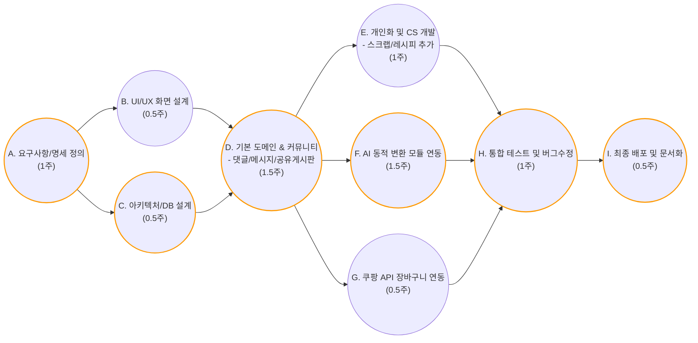

# 프로젝트 관리 계획서 (Project Management Plan)

- **프로젝트명:** 1인 가구를 위한 AI 기반 맞춤형 요리 도우미 어플리케이션 ‘든든(Deun Deun)’

## [Revision history]
| Revision date | Version | Description | Author |
|---|---|---|---|
|     26.10.04        |    0.1.0     |   첫 초안 잡기    |  kyujin      |
  
---
 

## 1단계: 대상 제어기 선택

### 1.1 시스템 개요
'든든(Deun Deun)'은 1인 가구, 자취생, 요리 초보자를 핵심 타겟으로 하는 지능형 요리 보조 어플리케이션입니다. 단순한 레시피 나열을 넘어, 사용자의 요구에 맞춰 조리법을 유동적으로 변환해 주는 맞춤형 서비스를 제공합니다.

### 1.2 프로젝트 기획 의도 및 목적
* **자원의 최적화 및 식비 절감:** 요리 초보자들이 겪는 식재료 낭비와 대체 도구 부족 문제를 생성형 AI를 통해 해결하여 1인 가구의 식생활 자립을 지원합니다.
* **사용자 경험(UX)의 심리스(Seamless)한 확장:** 레시피 확인 후 부족한 식재료를 다른 앱으로 이탈할 필요 없이, 쿠팡 오픈 API와 연계하여 앱 내에서 즉각적으로 장바구니에 담고 구매할 수 있는 End-to-End 요리 경험을 제공합니다.
* **지속 가능한 서비스 생태계 구축:** 스크랩, 랭킹, 레시피 추가, 식재료/도구 관리 가이드 및 CS(문의사항) 기능을 통해 사용자의 지속적인 앱 체류 및 활용을 유도합니다.

---

 

## 2단계: 프로젝트 범위 정의 

### 2.1 프로젝트 목표 (Objectives)
* 생성형 AI(Google API)를 활용하여 사용자 맞춤형 동적 레시피 변환 응답 속도 2초 이내 달성
* 쿠팡(Coupang) API 연동을 통한 식재료 탐색 및 장바구니 담기 성공률 99% 확보
* 도메인 클래스 30개 규모의 확장성 있고 유지보수가 용이한 객체 지향(Object-Oriented) 시스템 아키텍처 설계

### 2.2 범위 포함 사항 (In-Scope)
| 기능 그룹 | 상세 범위 (In-Scope) |
| :--- | :--- |
| **계정 및 권한 관리** | 회원가입, 로그인/로그아웃, 사용자/관리자 권한 분리 |
| **레시피 탐색 및 추천** | 키워드/식재료 기반 검색, 기간별(주/월/년) 인기 레시피 추천 순위 제공 |
| ** AI 레시피 동적 변환** | **Google GenAI API 연동**: 사용자 입력(보유 재료, 인원수, 대체 도구)에 따른 프롬프트 엔지니어링 및 자연스러운 맞춤형 조리법(계량, 순서) 텍스트 동적 생성 |
| ** 커머스 연동(식재료)** | **쿠팡 오픈 API 연동**: 부족한 식재료에 대한 실시간 상품 검색, 장바구니 담기 및 결제 페이지 리다이렉트 기능 구현 |
| **개인화 및 보관소** | 레시피 추가,찜(스크랩) 기능, 스크랩 목록 및 카테고리 내 검색, 재료/도구별 보관 및 관리 가이드 |
| **커뮤니티** | 유저 간의 댓글, 메시지, 레시피 공유 게시판을 포함한 SNS 기능 |
| **CS 및 운영 관리** | 사용자 문의사항 카테고리별 접수, 관리자 전용 페이지를 통한 답변 및 상태(대기/완료) 관리 기능 |

### 2.3 범위 제외 사항 (Out-of-Scope)
* **결제 게이트웨이(PG) 직접 구현:** 결제 및 배송 트래킹은 연동된 쿠팡 시스템에 위임하며, 본 앱 내에서 자체 결제 모듈을 개발하지 않습니다.
* **오프라인 요리 클래스 연계:** 실물 기반의 요리 강의나 멘토링 매칭 시스템은 제외합니다.

---

 

## 3단계: 시스템 문맥도 설명 및 이해관계자 분석

### 3.1 이해관계자 분석 (Stakeholder Analysis)
* **일반 사용자 (User):** 자신의 상황에 맞는 레시피를 원하고, 식재료를 편리하게 구매하고자 하는 1인 가구 및 자취생.
* **시스템 관리자 (Administrator):** 사용자 문의(버그 등)를 관리하고 응대하며 서비스 품질을 유지하는 운영 주체.
* **Google Generative AI (외부 시스템):** 앱 시스템으로부터 사용자의 재료/도구 데이터를 받아 적절하게 변환된 동적 레시피 텍스트를 반환하는 AI 프로바이더.
* **쿠팡 Commerce System (외부 시스템):** 식재료 검색 쿼리에 대한 상품 정보(이미지, 가격, 링크)를 제공하고 유저의 장바구니 담기 및 구매를 처리하는 커머스 프로바이더.

### 3.2 시스템 문맥도 구상안
문맥도(Context Diagram) 상의 데이터 흐름은 다음과 같이 정의됩니다.

* **[일반 사용자]** ⇄ (검색어, 조건 옵션, 장바구니 추가 요청, 문의 작성) ⇄ **[든든(Deun Deun) 시스템]** ⇄ (변환된 레시피, 상품 목록, 답변 확인) ⇄ **[일반 사용자]**
* **[관리자]** ⇄ (문의 목록 요청, 문의 답변 작성) ⇄ **[든든(Deun Deun) 시스템]**
* **[든든(Deun Deun) 시스템]** ⇄ (기존 레시피 + 유저 제약사항 프롬프트 전송) ⇄ **[Google GenAI API]** ⇄ (동적 변환된 맞춤형 레시피 JSON/Text 반환) ⇄ **[든든(Deun Deun) 시스템]**
* **[든든(Deun Deun) 시스템]** ⇄ (식재료 키워드 검색, API Auth Token 전송) ⇄ **[쿠팡 Open API]** ⇄ (상품 리스트 데이터, 장바구니/결제 딥링크 반환) ⇄ **[든든(Deun Deun) 시스템]**

---

 

## 4단계: 프로젝트 제약사항 

| 제약 유형 | 상세 내용 |
| :--- | :--- |
| **기술적 제약 (Technical)** | - Google API 및 쿠팡 API 호출 시 발생하는 **네트워크 지연(Latency)**을 최소화하기 위해 비동기 처리 및 로딩 UI(스켈레톤 UI 등) 필수 구현 - 쿠팡 오픈 API의 토큰 갱신 및 인증 프로토콜 규격 엄수 |
| **일정적 제약 (Schedule)** | - 소프트웨어 공학 학기 프로젝트 규모 및 시장 출시 목표를 고려하여 **기획~배포까지 총 2개월** 이내에 MVP(Minimum Viable Product) 완성을 목표로 함 |
| **법적/비용적 제약 (Legal/Cost)** | - **개인정보보호법:** 사용자의 이메일, 전화번호 등 민감 정보 암호화(SHA-256 등) 필수 적용 - **API 과금 로직:** Google AI API 토큰 사용량에 따른 과금을 방지하기 위해 프롬프트 길이 최적화 및 캐싱(Caching) 전략 필수 도입 |

---

 

## 5단계: 프로젝트 규모 및 비용 산정

도메인 모델링 시 **약 30개 규모의 클래스(Class)**가 도출되는 시스템 복잡도를 지니고 있으나, **1인 단독 개발**로 **약 2개월** 내에 완료해야 하는 제약사항이 있습니다. 이를 맞추기 위해 서버리스/BaaS 인프라와 최신 웹 프레임워크를 적극 활용하는 고생산성(RAD: Rapid Application Development) 환경을 가정하여 기능 점수(FP) 기반 규모 및 일정을 산정합니다.

### 5.1 규모 산정 논리 (Function Point 방식)
약 30개의 클래스는 MVC 아키텍처 및 도메인 주도 설계(DDD)를 기준으로 데이터 저장소(Entity)와 비즈니스 로직, 외부 인터페이스 등으로 구성됩니다.

1. **데이터 기능 (Data Functions): 약 50 FP**
   * **ILF (내부 논리 파일):** User, Recipe, Ingredient, CookingTool, Scrap, Inquiry 등 핵심 도메인 클래스를 복잡도 '낮음(Low)'으로 산정 (약 7개 × 5~7 FP = 약 40 FP)
   * **EIF (외부 연계 파일):** Google AI 모델 정보, 쿠팡 상품 정보 등 외부 API 연계 데이터 2개 (2개 × 5 FP = 10 FP)
2. **트랜잭션 기능 (Transactional Functions): 약 100 FP**
   * 30개 클래스와 연관된 CRUD 연산, AI 레시피 변환(EI/EO), 식재료 검색(EQ) 등 필수 트랜잭션 약 30개 도출.
   * 1인 개발에 맞춘 핵심 기능 위주 구현으로 복잡도 '낮음(Low)' 기준을 적용하여 30개 × 평균 3.3 FP = 약 100 FP.
3. **총 미조정 기능점수 (UFP): 150 FP**
   * 복잡도 조정 인자(VAF)를 1.0으로 가정 시, **최종 규모는 약 150 FP**로 산정됨.

### 5.2 투입 공수 및 일정 산정 (1인 개발 Agile/RAD 기반)
Next.js, Tailwind CSS 같은 최신 프론트엔드 프레임워크와 Supabase, Firebase 등의 BaaS(Backend as a Service)를 적극 활용하여 생산성을 극대화합니다.

* **투입 인력:** 1명 (단독 풀스택 개발)
* **목표 개발 기간:** 2개월 (약 8주)
* **목표 총 투입 공수(Man-Month):** 1명 × 2개월 = **2 MM**
* **요구 생산성 기준:** 150 FP / 2 MM = **월 75 FP / 1인**
* **산정 타당성 확보 논리:** 월 75 FP는 전통적 기준으로는 매우 높은 수치이나, 회원가입/인증, DB 구축 및 API 서버 구현을 Firebase 플랫폼으로 대체하고, UI 컴포넌트 라이브러리를 적극 활용하면 1인 개발로 2개월 내 MVP(Minimum Viable Product) 완성 및 배포가 충분히 가능합니다.

---

 

## 6단계: 주요 업무 구분 및 WBS (PERT Chart 기반)

### PERT Chart 

